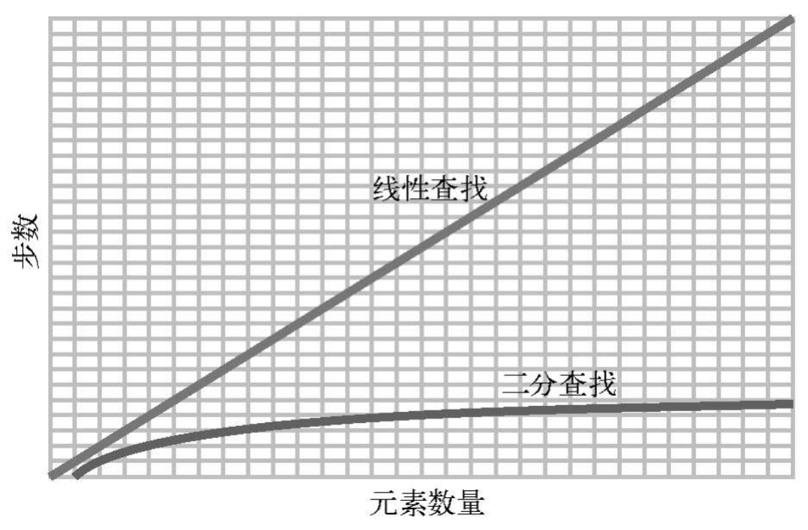

---
{
  title: '有序数组'
}
---
## 概念
有序数组与数组一样，最大的区别就是要求数值都是有顺序。每次插入新值时，都会被插入到适当的位置，是整个数组就是顺序排列。
| 1 | 4 | 11 | 58 |
|:--:|:--:|:--:|:--:|
插入7之后
| 1 | 4 | 7 | 11| 58|
|:-:|:-:|:-:|:-:|:-:|

## 形式
#### 读取
  与数组一样，根据索引直接读取数值，时间复杂度就是 *__O(1)__*

#### 查询

与常规数组最长的步数是集合的长度 *__N__* 不一样，有序数组使用的是二分查找。常规数组的查找使用的是线性查找，时间复杂度就是 *__O(N)__*，二分法查找的步数就是 *__log2 N__*，时间复杂度就是 *__O(logN)__*

#### 插入
数值：| 1 | 4 | 11| 58|
-|:--:|:--:|:--:|:--:|
索引：|  0 |  1 |  2 | 3  |
与数组不一样，因为值是有顺序排列，需要将插入的值从索引0开始一个一个遍历比对大小，是否与插入的相等，需要的步数是 *__索引 + 1__*，插入的索引后面的数值需要往后移一步，需要步数就是 *__N-索引-1__*，需要的步数是集合的长度 *__N__*，时间复杂度就是 *__O(N)__*，插入性能比不上常规数组的最大 *__N__*
#### 删除
与数组一样，删除具体索引的数值，后面的数值都要往前移一步，时间复杂度就是 *__O(N)__*
