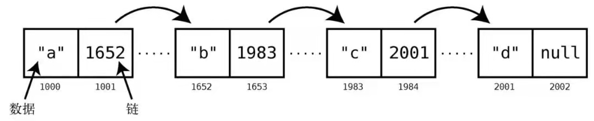

---
{
  title: '链表',
  tag: '链表'
}
---

# 链表

## 概念
**链表**是最简单的一种基于结点的数据结构。  
与数组一样，链表也用来表示一系列的元素。与数组不用的是，组成链表的格子不是连续的。它们可以分布在内存的各个地方。这种不相邻的格子，就叫做**结点**。  
计算机如何知道这些分散的结点属于这个链表还是其他链表？每个节点除了保存数据，它还保存着链表里的下一个结点的内存地址。这个用来指示下一个结点的内存地址的额外数据就是**链**。

此例中，我们的链表包含4项数据："a"、"b"、"c"和"d"。因为每个结点都需要2个格子，头一格用作数据存储，后一格用作指向下一结点的链（最后一个结点的链是null，因为它是终点），所以整体占用了8个格子。
